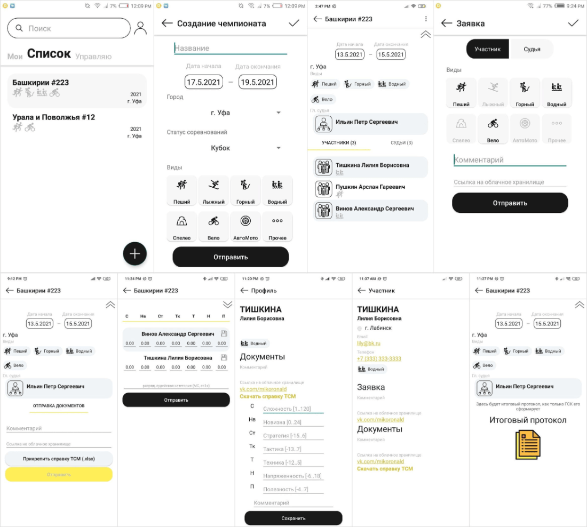

# A Tour

Мобильное Android (ver.>= 5.0) приложение для организации и проведения судейства чемпионатов по спортивному туризму.

### Главный экран с фрагментами (Мои, Список, Управляю, Поиск) MainActivity
отображает соответствующие списки чемпионатов

Мои - там, где пользователь принимает участие
Список - общий, 30 последних чемпионатов
Управляю - чемпионаты, созданные пользователем
Поиск - поиск по названию чемпионата

### Регистрация RegistrationActivity
	-ФИО
	-город
	-телефон
	-почта (40сим)
	-пароль (40сим)

### Аутентификация LoginActivity
	-логин (40сим)
	-пароль (40сим)

### Профиль ProfileActivity
отображает регистрационные данные 

	- вид туризма
	- проставленные оценки
	- поля ввода оценок
	- ссылку на заявку, документы
	- комментарии
	- кнопку скачивания справки о ТСМ
	- кнопку выхода из аккаунта

### Создание чемпионата ChampCreationActivity
	-название (40сим)
	-дата начала
	-дата окончания
	-город
	-статус (Чемпионат, Кубок, Первенство, Всероссийские)
	-виды (Пеший, Лыжный, Горный, Водный, Спелео, Вело, АвтоМото, Прочее)

### Подача заявки на чемпионат
	-выбор роли на чемпионате (Участник или Судья)
	-виды (Пеший, Лыжный, Горный, Водный, Спелео, Вело, АвтоМото, Прочее)
	-комметарий
	-ссылка на облачное хранилище

### Заявки
экран со списком заявок на чемпионат 

	- роль
	- ФИО
	- виды
доступен только создателю чемпионата
находится в правом верхнем углу на экране Чемпионата
здесь можно одобрить или отклонить заявку

### Чемпионат
	-название 
	-дата начала
	-дата окончания
	-город
	-статус (Чемпионат, Кубок, Перенство, Всероссийские)
	-виды (Пеший, Лыжный, Горный, Водный, Спелео, Вело, АвтоМото, Прочее)
	-ФИО и данные огранизатора

Чемпионат для участника:

	+ подача зявки
	+ подача документов
	+ отправка ТСМ справки
Чемпионат для организатора:

	+ заявки на вступление в чемпионат
	+ список судей
	+ список участников
Чемпионат для судьи:

	+ список участников
	+ список судей
	+ меню администрирования (Список заявок, Открыть/Закрыть прием заявок, создать Судейские протоколы, создать Итоговый протокол)

Инструменты:

IDE:	Android Studio

DB:		Realm DB, Firebase Realtime, Firebase Storage

Auth: 	Firebase Authentication

Docs:	Apache POI